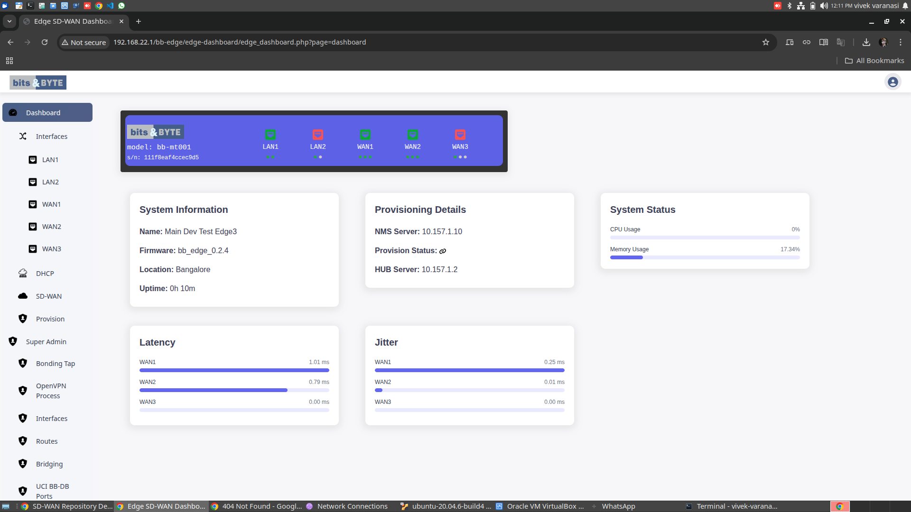

## Project Title:
                        SD-WAN
## Description:
This Project implements a Software-Defined Wide Area Network (SD-WAN) solution using OpenWrt-based embedded systems.
It enables intelligent traffic routing, multi-WAN load balancing, failover mechanisms, and network optimization for improved performance and reliability.

## Features:
- Multi-WAN Load Balancing
- Automatic Failover
- Policy-Based Routing (PBR)
- Real-time Link Monitoring
- Traffic Optimization
- Web Interface Support

## Architecture:
-  OpenWrt Firmware
-  Multiple WAN Interfaces (Ethernet/LTE)
-  Routing & Load Balancing Engine
-  onitoring & Control Layer

## Technologies Used:
- Embedded Linux (OpenWrt)
- C Programming
- Shell Scripting
- Network Protocols (TCP/IP, DHCP, DNS)
- Bits and bytes custom Dashboard

## Project Structure:
├── packages/        # Custom OpenWrt packages
├── scripts/         # Automation scripts
├── configs/         # Configuration files
├── docs/            # Documentation
└── README.md

## Installation:
1. Clone the repository
2. Integrate with OpenWrt build system
3. Compile firmware
4. Flash to target device
  
## Use Cases:
- Enterprise branch networking
- Industrial IOT Connectivity
- Redundant internet Connections

## Future Improvements:
- Cloud-Based centralized control
- AI-based traffic optimization
- Advanced analytics dashboard

## Dashboard Preview

This dashboard shows real-time WAN monitoring, system health, and network performance.

## My Contribution

- Built and customized OpenWrt firmware images using the Linux kernel and OpenWrt build system  
- Configured advanced networking features including bonding and tunneling for multi-WAN environments  
- Developed custom OpenWrt packages:
  - bb-db (core database service)
  - bb-db_ports (port management)
  - bb-db_tunnels (tunnel configuration and control)
- Implemented multi-WAN load balancing and failover mechanisms  
- Integrated WAN health monitoring (latency, jitter, packet loss) for intelligent routing decisions  
- Customized LuCI web interface and redirected it to a custom web dashboard for enhanced user experience  
- Developed a real-time dashboard for monitoring system status, WAN performance, and provisioning details  
- Automated configuration and deployment using shell scripts within the OpenWrt environment  
